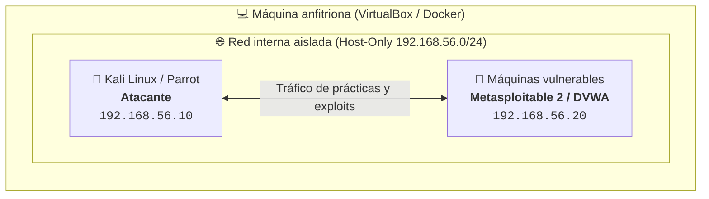

# Guía para montar tu propio laboratorio de pentesting

Montar un laboratorio controlado es uno de los pasos fundamentales para cualquier estudiante del **Curso de Especialización de Ciberseguridad**. En esta guía veremos cómo desplegar máquinas virtuales vulnerables y contenedores Docker para practicar.

---

## 1. Topología del laboratorio

Para evitar cualquier fuga de tráfico a tu red doméstica o del instituto, configuramos una red interna o modo *Host-Only*:



---

## 2. Despliegue rápido de DVWA con Docker

La forma más limpia y rápida de desplegar aplicaciones web vulnerables para prácticas es mediante Docker.

Ejecuta el siguiente comando para levantar **Damn Vulnerable Web Application (DVWA)**:

```bash
# Descargar y ejecutar contenedor de DVWA
docker run --rm -it -p 8080:80 vulnerables/web-dvwa
```

Una vez levantado, abre tu navegador en `http://localhost:8080` y sigue las instrucciones de inicialización de la base de datos (usuario: `admin`, contraseña: `password`).

---

## 3. Escaneo inicial con Nmap

Desde tu máquina atacante (Kali Linux), comprueba que la máquina objetivo responde y detecta servicios abiertos:

```bash
# Escaneo de puertos TCP con detección de versiones y scripts básicos
nmap -sV -sC -Pn -T4 192.168.56.20 -oN escaneo_inicial.txt
```

### Opciones recomendadas
- `-sV`: Identifica versiones de software y servicios.
- `-sC`: Ejecuta el conjunto de scripts por defecto de NSE.
- `-oN`: Guarda la salida formateada en un archivo de texto.

---

## 4. Buenas prácticas de seguridad en el laboratorio

> [!IMPORTANT]
> Nunca expongas máquinas vulnerables a redes públicas o Wi-Fi abiertas. Utiliza siempre adaptadores de red de tipo **Host-Only** o **Red Interna** en VirtualBox/VMware.

1. **Instantáneas (Snapshots)**: Toma una instantánea limpia antes de empezar a explotar un servicio para poder volver al estado inicial en segundos.
2. **Aislamiento de red**: Desactiva el adaptador de red en modo Puente (Bridge) cuando trabajes con malware o exploits activos.
3. **Documentación Docs-as-Code**: Documenta tus hallazgos en formato Markdown con evidencias y capturas.
