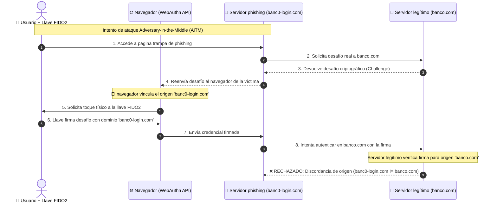

# MFA seguro: de contraseñas débiles a passkeys y FIDO2

La autenticación multifactor (**MFA**) es la primera línea de defensa para proteger identidades en la nube y accesos corporativos. Sin embargo, no todos los métodos de doble factor ofrecen el mismo nivel de protección.

> [!NOTE]
> Puedes consultar la definición completa y detallada de **MFA** en nuestro [Glosario de Ciberseguridad](https://cibercelia.github.io/glosario/terms/mfa/).

---

## Comparativa de factores de autenticación

| Método MFA | Nivel de seguridad | Resistente a phishing (AiTM) | Vulnerable a SIM swapping |
| :--- | :---: | :---: | :---: |
| **SMS / Llamada** | ⚠️ Bajo | ❌ No | ✅ Sí |
| **Email OTP** | ⚠️ Bajo | ❌ No | ❌ No |
| **App TOTP (Google/MS Auth)** | 🟡 Medio | ❌ No | ❌ No |
| **Notificación Push** | 🟡 Medio | ❌ No (Fatiga MFA) | ❌ No |
| **FIDO2 / Passkeys / WebAuthn** | 🟢 Muy Alto | ✅ **Sí** | ❌ No |

---

## ¿Por qué FIDO2 / Passkeys es resistente al phishing?

El estándar **FIDO2 (WebAuthn)** utiliza criptografía asimétrica vinculada criptográficamente al dominio del navegador (`Origin binding`):

---

## Recomendaciones para administradores

1. Forzar la deshabilitación del segundo factor vía SMS en entornos corporativos.
2. Habilitar **Number Matching** en notificaciones push para evitar ataques de fatiga MFA.
3. Desplegar autenticación basada en certificados o llaves físicas FIDO2 para usuarios con privilegios elevados (Domain Admins, Global Admins).
